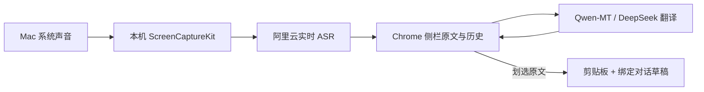

# Meeting Bridge

**macOS 系统声音实时转写、流式中文翻译，以及浏览器对话草稿助手。**

Live system-audio transcription and Chinese translation on macOS. Select transcript text to copy it and append it to a bound ChatGPT, DeepSeek or Qwen conversation. Messages remain drafts until you send them.

[使用说明](使用说明.md) · [English overview](#english-overview) · [贡献指南](CONTRIBUTING.md) · [MIT License](LICENSE)

## 能做什么

- 系统输出音频 → 阿里云实时转写，中英文混合识别；支持只采集腾讯会议的输出。
- Qwen-MT Flash 流式中文翻译，DeepSeek 可选；临时故障自动退避重试。
- 在连续原文中划选，松手即复制并追加到目标草稿；默认不弹框、不自动发送。
- ChatGPT、DeepSeek、千问和国际版 Qwen 网页对话绑定，保留现有草稿。
- 原文、译文和已选记录在本机保存；可调字号、确认后编辑、导出历史。
- 可选本地 Whisper Base 转写，以及试验性的腾讯会议可见转写文字 OCR。



## 安装：推荐的云转写路线

### 下载 Mac 预编译包（无需开发环境）

在 [GitHub Releases](https://github.com/Syuao/meeting-bridge/releases/latest) 下载 `MeetingBridge-0.6.2-macOS-arm64.zip`，解压后运行 `Install.command`。包内自带 Node.js、桥接依赖和编译好的声音采集程序。然后在 Chrome 的 `chrome://extensions` 开启开发者模式，加载 `~/Library/Application Support/MeetingBridge/extension`。

仅适用于 Apple Silicon Mac、macOS 13+。需要自己的百炼 API 密钥，API 另行计费。此体验包免费，无自动更新；本机采集程序使用临时签名，未获得 Apple 公证，首次打开可能需要手动确认。详细步骤见 [安装包使用说明](distribution/README.md)。仅下载 `extension.zip` 不包含 Mac 采集程序，不能独立完成转写。

### 环境

- macOS 13 或更新版本；开发与本机验证使用 Apple Silicon / macOS 15，Intel Mac 尚未实测。
- Google Chrome。以下源码安装另需 Node.js 22+、npm、Python 3、Git。
- Xcode Command Line Tools：终端运行 `xcode-select --install`，按系统提示安装。
- 阿里云百炼 API 密钥。语音与翻译独立按用量计费，网页聊天账户不会自动提供 API 额度。

### 从源码安装

```sh
git clone https://github.com/Syuao/meeting-bridge.git
cd meeting-bridge
npm ci --ignore-scripts
python3 scripts/build_capture.py
python3 install.py
```

随后在 Chrome 打开 `chrome://extensions`：

1. 开启「开发者模式」，点击「加载已解压的扩展程序」。
2. 选择克隆目录内的 **extension** 文件夹，固定 Meeting Bridge 到工具栏。
3. 打开目标聊天网站并登录，点击扩展图标；在「对话与采集设置」选择并绑定该标签页。
4. 保存百炼 API Key，地域选择与密钥一致。来源选「系统声音→阿里云实时转写」，问题提取选「手动选句」。
5. 开启「中文翻译」并选择 Qwen-MT，点击「开始监听」。首次使用按 macOS 提示允许系统录音。

源代码不包含编译后的 app、依赖目录或模型权重。**云转写无需下载 Whisper 模型。** 编译过程不触碰已经安装的采集程序；安装器会保留内容未改变的现有采集程序，减少重复授权。

录音权限、故障排查、切换对话与详细数据流请看[使用说明](使用说明.md)。当前通过开发者模式安装，尚未发布到 Chrome Web Store；本机 app 使用临时签名，未做 Apple 公证。

## 绑定网站

| 网站 | 地址 |
| --- | --- |
| ChatGPT | https://chatgpt.com/ |
| DeepSeek | https://chat.deepseek.com/ |
| 千问 | https://www.qianwen.com/ |
| Qwen | https://chat.qwen.ai/ |

先在对话中准备资料与提示词，再在侧栏绑定。切换到其他历史会话或标签页后重新绑定。手动划选始终只追加草稿，由使用者发送。网页改版可能需要更新输入框适配；项目与上述网站、腾讯会议无隶属关系。

## 可选：本地 Whisper 转写

云路线可跳过本节。需要 CMake 和 C++ 编译工具；构建会获取固定版本的 whisper.cpp：

```sh
cmake -S native -B .build/local-asr -DCMAKE_BUILD_TYPE=Release
cmake --build .build/local-asr --config Release --parallel 4
cmake --install .build/local-asr --prefix "$PWD" --component meeting-bridge
python3 scripts/download_model.py
python3 install.py
```

下载脚本验证模型的 SHA-256。依赖和模型存放在被 Git 忽略的目录。然后选择「系统声音→本机转写」；速度和准确率取决于设备及音频。本地 ASR 模式下，若开启云翻译，文字仍会发往所选翻译服务。

## 开发与验证

```sh
npm test
python3 scripts/check_repository.py
```

- Node 测试不访问真实 API；macOS 的安装测试需要先构建本机 helper。
- GitHub Actions 在 macOS 上构建 helper、运行测试，并安装到临时目录。
- 仓库检查脚本检查 Git 索引，阻止常见密钥、本机绝对路径、大文件与二进制误提交；提交前仍应查看 `git diff --cached`。
- [验证说明](docs/VALIDATION.md) 记录覆盖范围与实际限制。
- Apple Silicon Release 构建：`python3 scripts/build_release.py`。输出在被 Git 忽略的 `dist/`，通过明确文件清单打包，不读取已安装程序的密钥和历史；同时生成 SHA-256 校验文件。

| 目录 | 用途 |
| --- | --- |
| `extension/` | Chrome 侧栏、历史、对话绑定和草稿填入 |
| `host/` | Native Messaging 桥接、云 ASR 与翻译 |
| `native/` | Swift 音频采集、可选 Whisper C++ worker |
| `scripts/` | 构建、下载、提交内容检查 |
| `tests/` | 无真实 API 的逻辑和安装测试 |

## 隐私与费用

扩展历史保存在本机 Chrome；API 密钥保存在 `~/Library/Application Support/MeetingBridge` 中的受限文件，权限为 `600`。仓库不包含真实密钥、转写记录、简历、个人草稿或录音。

云 ASR 会上传系统音频，云翻译会上传待译文字。只采集系统输出，不采集麦克风；仅关闭侧栏不会停止监听，需要点击「停止」。使用时应取得会议参与者所需的同意，并遵守适用的会议或面试规则。

阿里云与 DeepSeek API 独立计费，价格和免费额度以服务商为准：[阿里云模型价格](https://help.aliyun.com/zh/model-studio/model-pricing)、[DeepSeek 价格](https://api-docs.deepseek.com/zh-cn/quick_start/pricing/)。模型输出可能有错，项目不保证识别或翻译准确率。

## English overview

Meeting Bridge combines a Chrome side panel with a local macOS Native Messaging host and a ScreenCaptureKit audio helper. It captures system output audio, streams it to Alibaba Cloud ASR, optionally translates the transcript through Qwen-MT or DeepSeek, and copies/appends selected source text to a bound web conversation. It does not automatically send manually selected text.

Requirements: macOS 13+, Chrome, Node.js 22+, Python 3, Xcode Command Line Tools, and an Alibaba Cloud API key for the default cloud route. Follow the source-install commands above, load `extension/` as an unpacked extension, and configure your own keys in the side panel. Build artifacts, API keys and downloaded models are excluded from Git.

## License

[MIT](LICENSE), copyright 2026 Syuao. Third-party components retain their own licenses; see [THIRD_PARTY_NOTICES.md](THIRD_PARTY_NOTICES.md).
